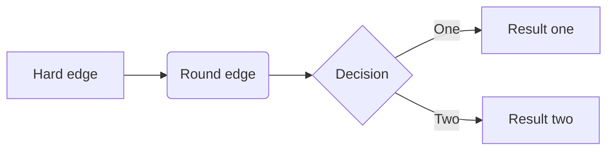

# F3DEX
Matching and mostly documented disassemblies of the F3DEX N64 RSP microcode family.

# Call graph

```mermaid
graph LR
A[Hard edge] -->B(Round edge)
    B --> C{Decision}
    C -->|One| D[Result one]
    C -->|Two| E[Result two]
```