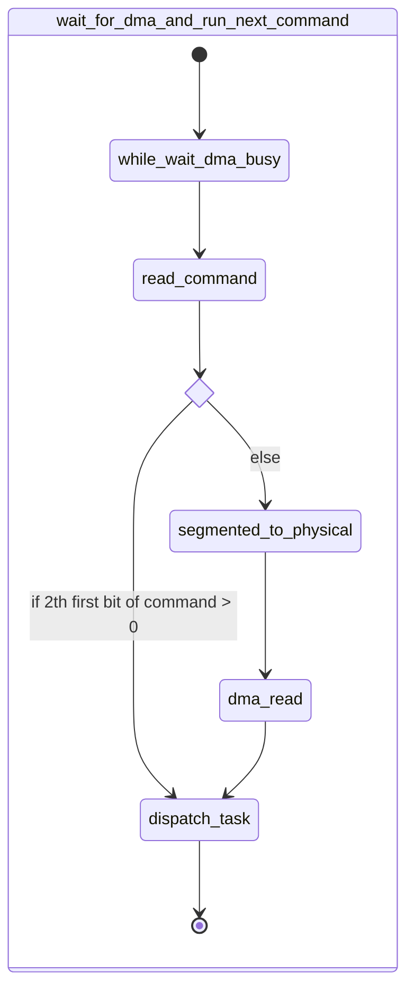

## wait_for_dma_and_run_next_command

```mermaid
stateDiagram-v2
    state if_2bits <<choice>>

    State wait_for_dma_and_run_next_command {
        [*] --> while_wait_dma_busy
        while_wait_dma_busy --> read_command
        read_command --> if_2bits
        if_2bits --> dispatch_task: if 2th first bit of command > 0
        if_2bits --> segmented_to_physical: else
        segmented_to_physical --> dma_read
        dma_read --> dispatch_task
        dispatch_task --> [*]
    }
```