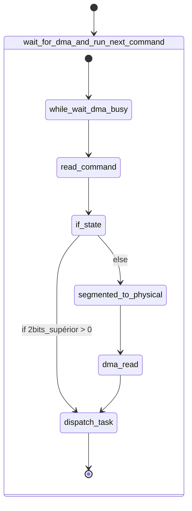

wait_for_dma_and_run_next_command

```mermaid
stateDiagram-v2
    [*] --> wait_for_dma_and_run_next_command

    State wait_for_dma_and_run_next_command {
        [*] --> while_wait_dma_busy
        while_wait_dma_busy --> read_command
        read_command --> if_state
        if_state --> dispatch_task: if 2bits_supérior > 0
        if_state --> segmented_to_physical: else
        segmented_to_physical --> dma_read
        dma_read --> dispatch_task
        dispatch_task --> [*]
    }
```